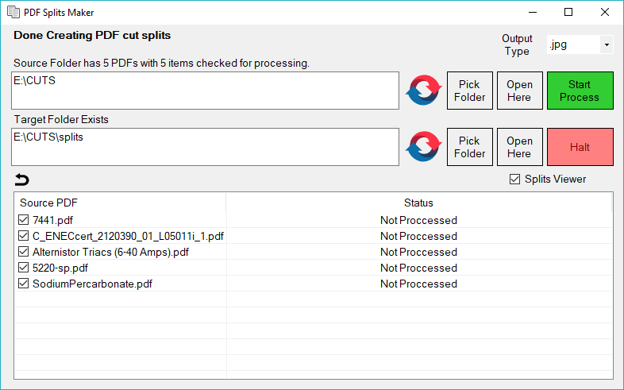
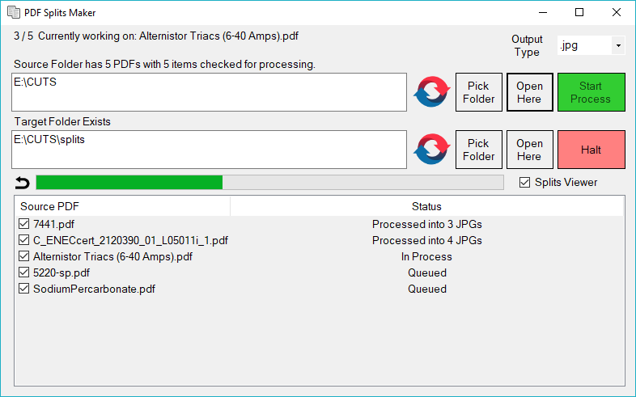
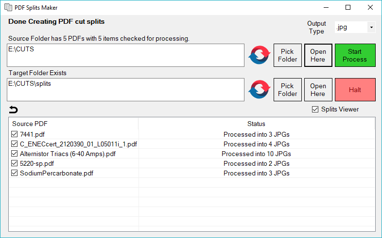
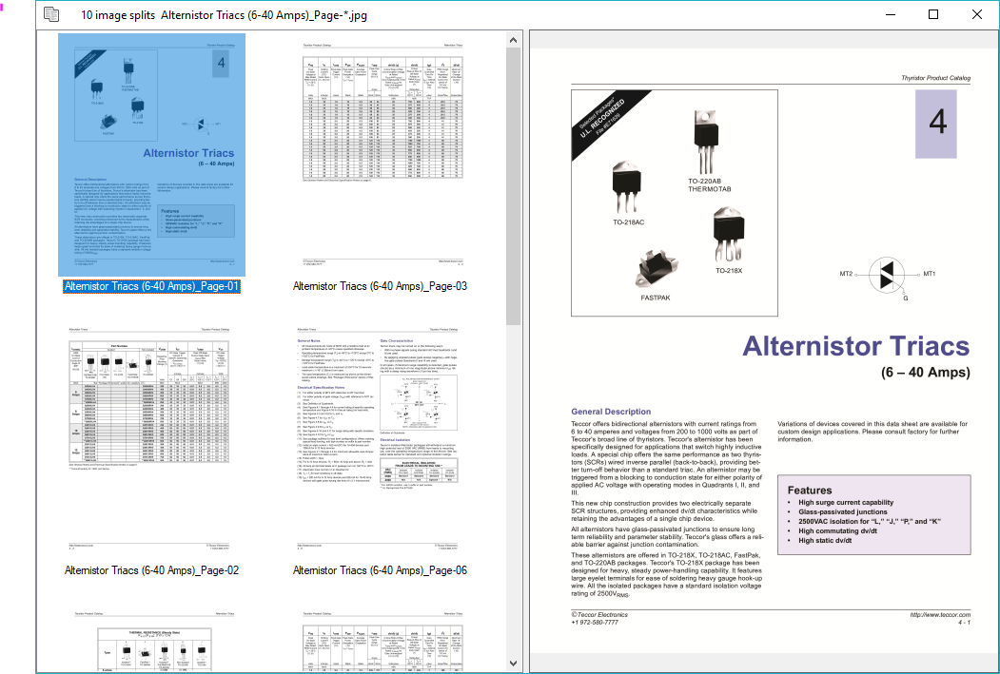

# PDFtoWhateverC

A front end program that splits a list of PDF files into individual image files that the user would be selecting for some purpose. Each PDF page is processed into the image type as desired.

This program is originally created to split manufacturer's product cut sheets into individual images where selected images are later annotated for incorporation into design proposals.

## Brief Instructions

- Specify the source folder where the PDFs reside.
- Specify the splits target folder. This folder should be carefully selected because **PDFtoWhateverC** is going to fill it up with files.
- Select the output type.
- Checkmark the source PDF files you want processed.
- Press the Start Process button.
- The file progress status is updated as the PDF files are processed.

- The process is accomplished with a background thread. The status indicates when the process is complete.

- When the **Splits Viewer** check box is checked then the image results for any PDF file that has been processed are displayed in a separate splits images viewer.

- The splits images viewer is intended for one to review the output and delete the images not needed. Pressing delete when any one or more images selected in the viewer allows one to delete the unwanted images.

## What Is Going On

- **ImageMagick** and **GhostScript** preform the tasks.

## Install

- Use the files in the AlreadyBuilt folder or rebuild using the repository VS project files.
- The **Magick.NET** file must be in the folder with the executable. **Magick.NET** is a .NET analogue for **ImageMagick**.
- **GhostScript** must also be loaded on your computer because **ImageMagick** relies on **GhostScript** for its PDF operations. In hindsight this program really should have been made without using **Magick.NET** and just relied on both **ImageMagick** and **GhostScript** loaded on your computer.
